# WEATHER APPLICATION

Цей проект розроблено з метою ознайомлення із роботою API, принципом отримання даних від віддаленого серверу, вмінням їх обробляти, структурувати та застосовувати у своємо проєкті. А саме застосовувалось API такого веб-ресурсу як [OpenWeatherMap](https://openweathermap.org). Проєкт допоможе розібратися із роботою файлів JSON, як правильно отримувати та зберігати дані у файлах з типом .json. Та познайомити користувача з інтерфейсом застосунку розробленим за допомогою пакету [CustomTkinter](https://customtkinter.tomschimansky.com)

### Зміст:
- [Основні модулі проєкту](#modules)
- [Розгортання проєкту](#download)
- [Створення віртуального оточення проєкту](#venv)
- [Завантаження модулей до віртуального оточення](#download-venv)
- [Старт проєкту](#start-project)
- [Структура проєкту](#structure)
- [Основні механіки проєкту](#mechanics)
- [Висновок по проєкту](#result)

### Modules:
Всі модулі
1. [customtkinter](https://customtkinter.tomschimansky.com)
2. [json](https://docs.python.org/3/library/json.html)
3. [colorama](https://pypi.org/project/colorama/)
4. [os](https://docs.python.org/uk/3.13/library/os.html)
5. [requests](https://pypi.org/project/requests/)
6. [pillow](https://pypi.org/project/pillow/)
7. [datetime](https://docs.python.org/3/library/datetime.html)

### Download:
Завантаження проєкту
- ##### Git clone:

    - Отримати посилання для клонування проєкту

    

    - Відкрити VSCode --> у Explorer VSCode відкрити папку для збереження склонованого проєкту --> та у Terminal прописати команду: 
    - `git clone https://github.com/WorldIT-academy/WeatherApp.git`

    

    - Відкрити каталог, який ви склонували у Explorer VSCode
    
- ##### Download ZIP
  - Завантажити zip-архів проекту:
  
  - Розархівувати у необхідну папку
  - Відкрити цю папку у VSCode

### Venv:
Створення віртуального оточення
1. Відкрийте термінал у кореневій папці проєкту.
2. Виконайте команду для створення віртуального оточення:
   - `python -m venv venv` 
3. Активуйте віртуальне оточення:
- Для Windows:
  - `venv\Scripts\activate`  
- Для MacOS/Linux:
  - `source venv/bin/activate`  

### Download venv:
Завантаження модулів до venv
1. Переконайтесь, що віртуальне оточення активоване.
2. Встановіть необхідні модулі командою:
  - `pip install -r requirements.txt`  

### Start project:
Cтарт проєкту
1. Переконайтесь, що віртуальне оточення активоване.
2. Запустіть головний файл проєкту за допомогою VSCode або командою:
   - python main.py

### Structure 
Структура проекту

```mermaid
graph TD
    A[WeatherApp]
    A --> B[images]
    B --> B1(01d.png)
    B --> B2(01n.png)
    B --> B3(02d.png)
    B --> B4(02n.png)
    B --> B5(03d.png)
    B --> B6(03n.png)
    B --> B7(04d.png)
    B --> B8(04n.png)
    B --> B9(09d.png)
    B --> B10(09n.png)
    B --> B11(10d.png)
    B --> B12(10n.png)
    B --> B13(11d.png)
    B --> B14(11n.png)
    B --> B15(13d.png)
    B --> B16(13n.png)
    B --> B17(arrow_down.png)
    B --> B18(arrow_up.png)
    B --> B19(loope.png)
    A --> C[modules]
    C --> C1(__init__.py)
    C --> C2(read_json.py)
    C --> C3(write_json.py)
    C --> C4(weather_data.py)
    C --> C5[gui]
    C5 --> G1(__init__.py)
    C5 --> G2(city_weather.py)
    C5 --> G3(forecast_component.py)
    C5 --> G4(forecast_frame.py)
    C5 --> G5(image.py)
    C5 --> G6(main_info.py)
    C5 --> G7(main_screen.py)
    C5 --> G8(side_bar.py)
    A --> D[static]
    D --> D1(config.json)
    D --> D2(forecast.json)
    D --> D3(weather_data.json)
    D --> D4[icon]
    D4 --> I1(big screen.png)
    D4 --> I2(clone_command.png)
    D4 --> I3(clone_link.png)
```

### Mechanics:
Основні механіки проєкту

- Отримання та обробка погодних даних через API [OpenWeatherMap](https://openweathermap.org).
- Збереження та читання даних у форматі JSON.
- Відображення поточної погоди та прогнозу для вибраного міста.
- Графічний інтерфейс користувача на базі бібліотеки CustomTkinter.
- Можливість просмотру кількох міст для перегляду погоди.
- Відображення відповідних іконок погоди згідно з отриманими даними.

### Result:
Висновок

Даний проєкт демонструє практичне використання API для отримання та обробки погодних даних, роботу з файлами JSON, а також створення сучасного графічного інтерфейсу користувача на Python. Застосунок дозволяє швидко отримувати актуальну інформацію про погоду у різних містах, зручно переглядати прогноз та візуалізувати дані за допомогою іконок. Проєкт може бути корисним для ознайомлення з основами роботи з API, організацією структури Python-проєкту та створенням GUI-додатків.