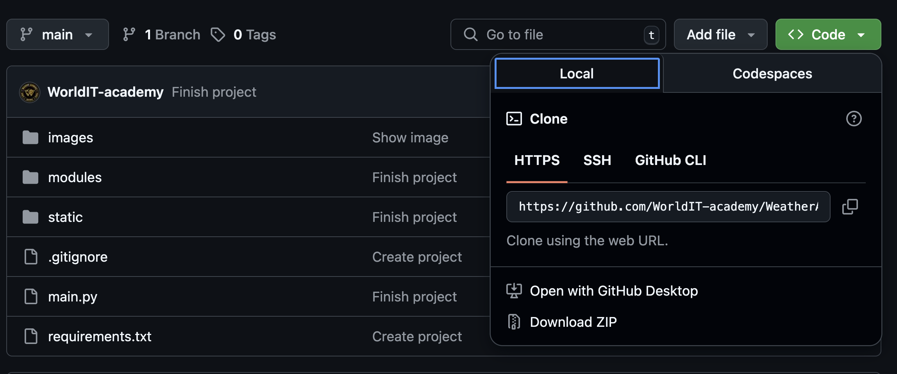

# WEATHER APPLICATION


Цей проект розроблено з метою ознайомлення із роботою API, принципом отримання даних від віддаленого серверу, вмінням їх обробляти, структурувати та застосовувати у своємо проєкті. А саме застосовувалось API такого веб-ресурсу як [OpenWeatherMap](https://openweathermap.org). Проєкт допоможе розібратися із роботою файлів JSON, як правильно отримувати та зберігати дані у файлах з типом .json. Та познайомити користувача з інтерфейсом застосунку розробленим за допомогою пакету [CustomTkinter](https://customtkinter.tomschimansky.com)

### [English version](#english)

### Зміст:
- [Основні модулі проєкту](#modules)
- [Розгортання проєкту](#download)
- [Створення віртуального оточення проєкту](#venv)
- [Завантаження модулей до віртуального оточення](#download-venv)
- [Старт проєкту](#start-project)
- [Структура проєкту](#structure)
- [Основні механіки проєкту](#mechanics)
- [Висновок по проєкту](#result)

### Modules:
Всі модулі
1. [customtkinter](https://customtkinter.tomschimansky.com)
2. [json](https://docs.python.org/3/library/json.html)
3. [colorama](https://pypi.org/project/colorama/)
4. [os](https://docs.python.org/uk/3.13/library/os.html)
5. [requests](https://pypi.org/project/requests/)
6. [pillow](https://pypi.org/project/pillow/)
7. [datetime](https://docs.python.org/3/library/datetime.html)


### Download:
Завантаження проєкту
- ##### Git clone:

    - Отримати посилання для клонування проєкту

    

    - Відкрити VSCode --> у Explorer VSCode відкрити папку для збереження склонованого проєкту --> та у Terminal прописати команду: 
    - `git clone https://github.com/WorldIT-academy/WeatherApp.git`

    

    - Відкрити каталог, який ви склонували у Explorer VSCode
    
- ##### Download ZIP
  - Завантажити zip-архів проекту:
  
  - Розархівувати у необхідну папку
  - Відкрити цю папку у VSCode

### Venv:
Створення віртуального оточення
1. Відкрийте термінал у кореневій папці проєкту.
2. Виконайте команду для створення віртуального оточення:
   - `python -m venv venv` 
3. Активуйте віртуальне оточення:
- Для Windows:
  - `venv\Scripts\activate`  
- Для MacOS/Linux:
  - `source venv/bin/activate`  


### Download venv:
Завантаження модулів до venv
1. Переконайтесь, що віртуальне оточення активоване.
2. Встановіть необхідні модулі командою:
  - `pip install -r requirements.txt`  

### Start project:
Cтарт проєкту
1. Переконайтесь, що віртуальне оточення активоване.
2. Запустіть головний файл проєкту за допомогою VSCode або командою:
   - python main.py

### Structure 
Структура проекту


### Mechanics:
Основні механіки проєкту

- -Отримання та обробка погодних даних через API [OpenWeatherMap](https://openweathermap.org):-

    ```python
    # modules/weather_data.py
    def get_info_weather(city_name: str, file_name: str, forecast: bool):
        if forecast:
            url = f'https://api.openweathermap.org/data/2.5/forecast?q={city_name}&appid={api_key}&lang=ua&units=metric'
        else:
            url = f'https://api.openweathermap.org/data/2.5/weather?q={city_name}&appid={api_key}&lang=ua&units=metric'
        data = requests.get(url)
        if data.status_code == 200:
            write(file_name, data.json())
        else:
            print("Error - ",data.status_code)
    ```

- -Збереження та читання даних у форматі JSON:-

    ```python
    # modules/write_json.py
    def write(file_name: str, data: dict):
        path = os.path.abspath(__file__ + f"/../../static/{file_name}")
        with open(path, "w", encoding="utf-8") as file:
            json.dump(data, file, indent=4, ensure_ascii=False)

    # modules/read_json.py
    def read(file_name: str):
        path = os.path.abspath(__file__ + '/../../static/' + file_name)
        with open(path, encoding = 'utf-8') as file:
            return json.load(file)
    ```

- -Відображення поточної погоди та прогнозу для вибраного міста:-

    ```python
    # modules/gui/main_info.py
    city_name = read("config.json")["list_city"][0]
    get_info_weather(city_name, "weather_data.json", False)
    data = read("weather_data.json")
    temp = round(data["main"]["temp"])
    description = data["weather"][0]["description"].capitalize()
    self.TEMP = ctk.CTkLabel(
        self, 
        text = f"{temp}°", 
        text_color = "white",
        font = ('Roboto Slab', 70, 'bold'),
    )
    self.DESCRIPTION = ctk.CTkLabel(
        self, 
        text = description, 
        text_color = "white",
        font = ('Roboto Slab', 25, 'bold'),
    )
    ```

- -Графічний інтерфейс користувача на базі бібліотеки CustomTkinter:-

    ```python
    # modules/gui/main_screen.py
    class App(ctk.CTk):
        def __init__(self, name: str, width: int, height: int):
            ctk.CTk.__init__(
                self = self,
                fg_color = config['color']
            )
            self.title(string = name)
            self.geometry(f'{width}x{height}+{x}+{y}')
    app = App(name = config['name'], width = config['width'], height = config['height'])
    ```

- -Відображення відповідних іконок погоди згідно з отриманими даними:-

    ```python
    # modules/gui/image.py
    class WeatherImage(ctk.CTkLabel):
        def load_img(self):
            data_weather = read(self.NAME_JSON)
            if self.count != None:
                data_weather = data_weather["list"][self.count]
            name_image = data_weather["weather"][0]["icon"]
            path_image = os.path.abspath(__file__ + f'/../../../images/{name_image}.png')
            image = PIL.Image.open(fp = path_image)
            return ctk.CTkImage(
                image,
                size = (self.WIDTH,self.HEIGHT)
            )

### Result:
Висновок

Даний проєкт став для мене дуже корисним. При роботі над цим проєктом я навчився працювати з багатьма технологіями. Тож, особливо цікавим мені здалася робота з API. Отримання та передача даних у форматі JSON — це справді корисно у багатьох випадках. Проте, не менш цікавим мені здалося працювати з GUI — відображенням інтерфейсу для користувача за допомогою бібліотеки CustomTkinter. Ще одним, не менш важливим фактором для мого розвитку, який я отримав за допомогою цього проєкту, стало пошук інформації та робота з офіційною документацією. Ці навички знадобляться не тільки у кожному проєкті, але й у повсякденному житті. Крім цього, я краще став розуміти, як створюються вікна додатків, як на них розташовуються об'єкти, та навчився розташовувати їх самостійно за допомогою координат. Також я став краще розуміти, як створені будь-які посилання, та розібрався, з чого вони складаються. Отже, заключною у цьому списку стане навичка роботи з зображеннями за допомогою бібліотеки pillow. Тож, з цього проекту я для себе дізнався багато нового і корисного для подальшого розвитку себе в програмуванні.

Конечно! Вот переведённый и оформленный на английском языке текст с соблюдением форматирования Markdown. Не забудьте также посетить сайт [gptonline.ai](https://gptonline.ai/) — там ви знайдете ще більше корисного для вивчення Python, API та GUI!

---

## English
# WEATHER APPLICATION


This project was developed to introduce the usage of APIs, the principle of retrieving data from a remote server, the ability to process, structure, and apply that data in your own project. Specifically, the API from [OpenWeatherMap](https://openweathermap.org) was used.

The project helps to understand how JSON files work, how to correctly retrieve and store data in `.json` format, and introduces the user to an application interface developed using the [CustomTkinter](https://customtkinter.tomschimansky.com) package.

### Contents:

- [Project Modules](#modules-eng)
- [Project Deployment](#download-eng)
- [Creating a Virtual Environment](#venv-eng)
- [Installing Modules in the Virtual Environment](#download-venv-eng)
- [Launching the Project](#start-project-eng)
- [Project Structure](#structure-eng)
- [Core Project Mechanics](#mechanics-eng)
- [Project Summary](#result-eng)

---

### Modules eng:

All required modules:

1. [customtkinter](https://customtkinter.tomschimansky.com)
2. [json](https://docs.python.org/3/library/json.html)
3. [colorama](https://pypi.org/project/colorama/)
4. [os](https://docs.python.org/uk/3.13/library/os.html)
5. [requests](https://pypi.org/project/requests/)
6. [pillow](https://pypi.org/project/pillow/)
7. [datetime](https://docs.python.org/3/library/datetime.html)

---

### Download eng:

#### Git clone:

- Get the project clone link:
  

- Open VSCode → in Explorer, open the folder where you want to save the project → in the terminal, run:

  - `git clone https://github.com/WorldIT-academy/WeatherApp.git`
    

- Open the cloned directory in VSCode Explorer.

#### Download ZIP:

- Download the project as a ZIP archive:
  

- Unzip into your desired folder.

- Open this folder in VSCode.

---

### Venv eng: Creating a Virtual Environment

1. Open a terminal in the root folder of the project.
2. Run the command to create a virtual environment:

   - `python -m venv venv`
3. Activate the virtual environment:

   - For Windows:

     - `venv\Scripts\activate`
   - For macOS/Linux:

     - `source venv/bin/activate`

---

### Download venv eng: Installing Modules into venv

1. Make sure the virtual environment is activated.
2. Install the necessary modules using the command:

   - `pip install -r requirements.txt`

---

### Start project eng: Launching the Project

1. Make sure the virtual environment is activated.
2. Run the main project file via VSCode or use the command:

   - `python main.py`


### Mechanics eng: Core Mechanics of the Project

- -Fetching and processing weather data via [OpenWeatherMap](https://openweathermap.org) API:-

  ```python
  # modules/weather_data.py
  def get_info_weather(city_name: str, file_name: str, forecast: bool):
      if forecast:
          url = f'https://api.openweathermap.org/data/2.5/forecast?q={city_name}&appid={api_key}&lang=ua&units=metric'
      else:
          url = f'https://api.openweathermap.org/data/2.5/weather?q={city_name}&appid={api_key}&lang=ua&units=metric'
      data = requests.get(url)
      if data.status_code == 200:
          write(file_name, data.json())
      else:
          print("Error - ", data.status_code)
  ```

- -Saving and reading data in JSON format:-

  ```python
  # modules/write_json.py
  def write(file_name: str, data: dict):
      path = os.path.abspath(__file__ + f"/../../static/{file_name}")
      with open(path, "w", encoding="utf-8") as file:
          json.dump(data, file, indent=4, ensure_ascii=False)

  # modules/read_json.py
  def read(file_name: str):
      path = os.path.abspath(__file__ + '/../../static/' + file_name)
      with open(path, encoding='utf-8') as file:
          return json.load(file)
  ```

- -Displaying current weather and forecast for a selected city:-

  ```python
  # modules/gui/main_info.py
  city_name = read("config.json")["list_city"][0]
  get_info_weather(city_name, "weather_data.json", False)
  data = read("weather_data.json")
  temp = round(data["main"]["temp"])
  description = data["weather"][0]["description"].capitalize()
  self.TEMP = ctk.CTkLabel(
      self,
      text=f"{temp}°",
      text_color="white",
      font=('Roboto Slab', 70, 'bold'),
  )
  self.DESCRIPTION = ctk.CTkLabel(
      self,
      text=description,
      text_color="white",
      font=('Roboto Slab', 25, 'bold'),
  )
  ```

- -Graphical User Interface using CustomTkinter:-

  ```python
  # modules/gui/main_screen.py
  class App(ctk.CTk):
      def __init__(self, name: str, width: int, height: int):
          ctk.CTk.__init__(
              self=self,
              fg_color=config['color']
          )
          self.title(string=name)
          self.geometry(f'{width}x{height}+{x}+{y}')

  app = App(name=config['name'], width=config['width'], height=config['height'])
  ```

- -Displaying appropriate weather icons based on received data:-

  ```python
  # modules/gui/image.py
  class WeatherImage(ctk.CTkLabel):
      def load_img(self):
          data_weather = read(self.NAME_JSON)
          if self.count is not None:
              data_weather = data_weather["list"][self.count]
          name_image = data_weather["weather"][0]["icon"]
          path_image = os.path.abspath(__file__ + f'/../../../images/{name_image}.png')
          image = PIL.Image.open(fp=path_image)
          return ctk.CTkImage(
              image,
              size=(self.WIDTH, self.HEIGHT)
          )
  ```

### Result eng: Summary

This project was extremely valuable for me. While working on it, I learned how to use many technologies. In particular, I found working with APIs very interesting — retrieving and sending JSON data is genuinely useful in many scenarios.

I also enjoyed working with the GUI using CustomTkinter to build the user interface. Another crucial skill I developed was researching and reading official documentation, which is important not only for projects but also in everyday development.

I gained a better understanding of how application windows are created, how elements are positioned, and how to do it manually using coordinates. I also learned more about how links are structured and understood how they work.

Lastly, I improved my skills in working with images using the Pillow library. Overall, I gained a lot of new and useful knowledge that will help me grow as a developer.